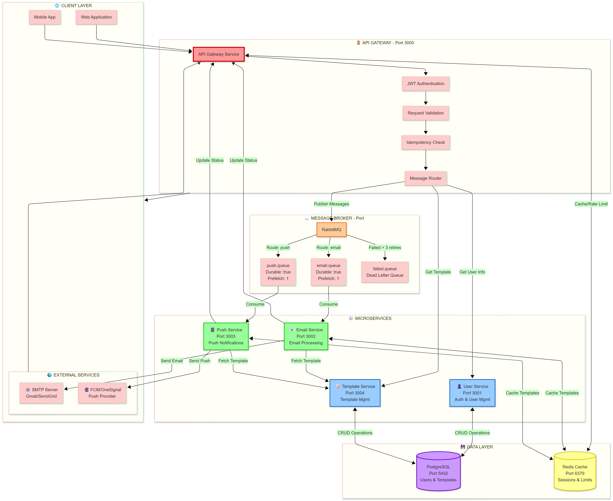
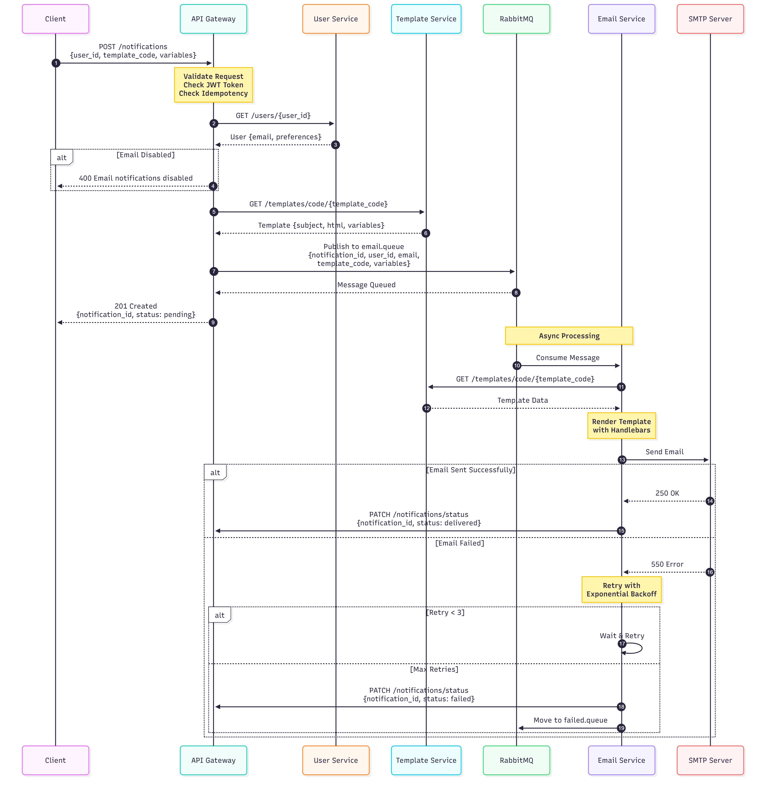
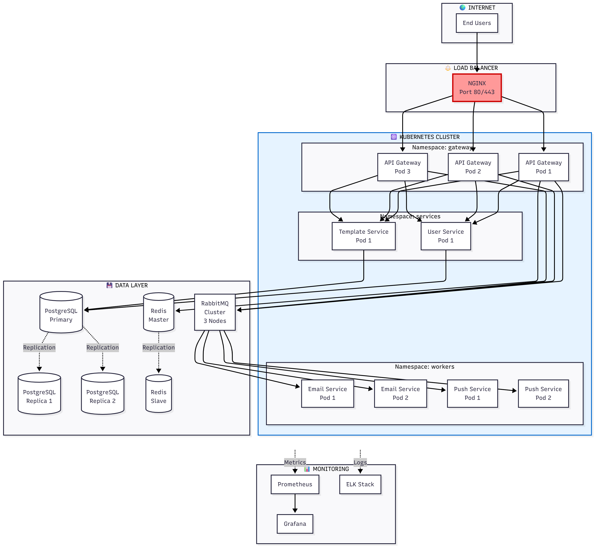

# 🔔 Notification System

A production-ready, scalable notification system built with microservices architecture using Docker. Handles email and push notifications with high reliability, fault tolerance, and comprehensive monitoring.



## 🚀 Features

- **Multi-Channel Notifications**: Email and Push notifications with unified API
- **Broadcast Delivery**: Send notifications across multiple channels simultaneously
- **Message Queuing**: Reliable async delivery with RabbitMQ and dead letter queues
- **Template Management**: Dynamic templates with variable substitution (Handlebars)
- **Circuit Breaker**: Fault tolerance with automatic service recovery
- **Idempotency**: Duplicate prevention using request IDs
- **Service Discovery**: Redis-based service registry
- **Real-time Monitoring**: Prometheus metrics + Grafana dashboards
- **Health Checks**: Comprehensive monitoring for all services
- **Retry Mechanism**: Exponential backoff for failed deliveries
- **Docker Deployment**: Single Dockerfile with multi-stage builds
- **Production Ready**: Nginx reverse proxy, SSL/TLS, environment configs

## 📊 Architecture

### Microservices

- **API Gateway** (Port 3000): Main entry point, authentication, notification routing
- **User Service** (Port 3001): User management, authentication, JWT tokens
- **Email Service** (Port 3002): SMTP-based email delivery via Mailtrap/SendGrid
- **Push Service** (Port 3003): Firebase Cloud Messaging (FCM) integration
- **Template Service** (Port 3004): Template CRUD and rendering engine

### Infrastructure

- **PostgreSQL**: Primary datastore (users, notifications, templates)
- **RabbitMQ**: Message broker with dead letter exchange
- **Redis**: Caching, service discovery, session management
- **Prometheus**: Metrics collection and time-series data
- **Grafana**: Monitoring dashboards and alerts
- **Docker**: Containerized deployment with docker-compose



## 🛠️ Tech Stack

- **Framework**: NestJS (TypeScript/Node.js 20+)
- **Message Queue**: RabbitMQ 3.12
- **Database**: PostgreSQL 15 with TypeORM
- **Cache**: Redis 7
- **Push**: Firebase Cloud Messaging (FCM)
- **Email**: SMTP (Mailtrap, SendGrid, AWS SES)
- **Monitoring**: Prometheus + Grafana
- **Documentation**: Swagger/OpenAPI
- **Deployment**: Docker + Docker Compose
- **Container**: Docker + Docker Compose
- **Fault Tolerance**: Opossum Circuit Breaker

## 📋 Prerequisites

- **Docker**: v24+ (recommended for deployment)
- **Docker Compose**: v2.20+
- **Node.js**: v20+ (for local development only)
- **Git**: v2.30+

## 🚀 Quick Start (Docker - Recommended)

### 1. Clone the Repository

```bash
git clone https://github.com/youneedgreg/notification-system.git
cd notification-system
```

### 2. Configure Environment (Optional for Local Testing)

> ⚠️ **SECURITY WARNING**: The `.env` files contain test credentials. **DO NOT use in production!** Change all passwords, secrets, and API keys before deploying to a server.

**For local testing**: The existing `.env` files work as-is.

**For production**: Change these critical values:
- `DB_PASSWORD` / `POSTGRES_PASSWORD` - Strong password (20+ chars)
- `REDIS_PASSWORD` - Strong password
- `RABBITMQ_PASSWORD` - Strong password  
- `JWT_SECRET` - Generate: `openssl rand -base64 32`
- `JWT_REFRESH_SECRET` - Generate: `openssl rand -base64 32`
- `SMTP_*` - Production email provider credentials
- `FIREBASE_SERVICE_ACCOUNT_PATH` - Production Firebase credentials

### 3. Start All Services with Docker

```bash
# Build and start all services (infrastructure + microservices)
docker-compose up -d --build
```

This single command starts:
- ✅ PostgreSQL database
- ✅ Redis cache
- ✅ RabbitMQ message broker
- ✅ Prometheus metrics
- ✅ Grafana dashboards
- ✅ All 5 microservices (API Gateway, User, Email, Push, Template)

Wait ~30 seconds for services to initialize.

### 4. Verify Services

```bash
# Check all containers are running
docker-compose ps

# View logs
docker-compose logs -f api-gateway
```

**Access Points**:
- API Gateway: http://localhost:3000
- User Service: http://localhost:3001
- Email Service: http://localhost:3002
- Push Service: http://localhost:3003
- Template Service: http://localhost:3004
- RabbitMQ UI: http://localhost:15672 (user: `rabbitmq_user` / pass: `rabbitmq_pass_2024`)
- Grafana: http://localhost:3100 (user: `admin` / pass: `admin123`)
- Prometheus: http://localhost:9090

### 5. Run Tests

```bash
# Automated test suite (tests all endpoints)
bash test-notifications.sh
```

### 6. Stop Services

```bash
# Stop all services
docker-compose down

# Stop and remove all data
docker-compose down -v
```

## 🔧 Local Development (Without Docker)

If you prefer to run services locally without Docker:

```bash
# Install dependencies
npm install

# Start infrastructure only
docker-compose up -d postgres redis rabbitmq prometheus grafana

# Start all microservices
npm run start:all
```

## 📖 API Documentation

### Swagger UI

Access interactive API documentation:
- **API Gateway**: http://localhost:3000/api/docs

### Key Endpoints

#### Authentication

```bash
# Register User
POST /api/v1/auth/register
Content-Type: application/json

{
  "email": "user@example.com",
  "password": "SecurePass123!",
  "name": "John Doe"
}

# Login
POST /api/v1/auth/login
Content-Type: application/json

{
  "email": "user@example.com",
  "password": "SecurePass123!"
}
```

#### Notifications

```bash
# Send Email Notification
POST /api/v1/notifications/send
Authorization: Bearer <token>
Content-Type: application/json

{
  "type": "email",
  "recipient": "user@example.com",
  "template_code": "WELCOME_EMAIL",
  "variables": {
    "username": "John Doe",
    "app_name": "Notification System"
  },
  "request_id": "unique-id-12345"
}

# Send Push Notification
POST /api/v1/notifications/send
Authorization: Bearer <token>
Content-Type: application/json

{
  "type": "push",
  "recipient": "fcm_device_token",
  "template_code": "ORDER_UPDATE",
  "variables": {
    "order_id": "ORD-12345",
    "status": "shipped"
  }
}

# Broadcast (Email + Push)
POST /api/v1/notifications/broadcast
Authorization: Bearer <token>
Content-Type: application/json

{
  "user_id": "uuid",
  "email": "user@example.com",
  "push_token": "fcm_token",
  "email_template_code": "WELCOME_EMAIL",
  "push_template_code": "WELCOME_PUSH",
  "variables": {
    "username": "John Doe"
  },
  "request_id": "broadcast-12345",
  "priority": "high"
}

# Get Notification History
GET /api/v1/notifications/history
Authorization: Bearer <token>
```

#### Templates

```bash
# Create Template
POST /api/v1/templates
Content-Type: application/json

{
  "name": "Welcome Email",
  "code": "WELCOME_EMAIL",
  "type": "email",
  "subject": "Welcome to {{app_name}}!",
  "html_content": "<h1>Welcome {{username}}!</h1>",
  "variables": ["username", "app_name"]
}

# Get All Templates
GET /api/v1/templates

# Get Template by Code
GET /api/v1/templates/code/WELCOME_EMAIL
```

## 🔍 Monitoring

### Grafana Dashboard

**URL**: http://localhost:3100  
**Credentials**: admin / admin123

Monitors:
- Request rates and latency
- Queue depths and processing rates
- Success/failure rates
- Service health status
- Database connection pools
- Memory and CPU usage



### Prometheus Metrics

**URL**: http://localhost:9090

Available metrics:
- `notification_sent_total` - Total notifications sent
- `notification_failed_total` - Failed notification count
- `http_request_duration_seconds` - API latency
- `queue_depth` - RabbitMQ queue size

### RabbitMQ Management

**URL**: http://localhost:15672  
**Credentials**: rabbitmq_user / rabbitmq_pass_2024

Monitor:
- `email.queue` - Email notifications
- `push.queue` - Push notifications
- `failed.queue` - Dead letter queue

## 🧪 Testing

### Automated Testing

```bash
# Full test suite (11 scenarios)
bash test-notifications.sh
```

Tests include:
- ✅ Health checks for all services
- ✅ Template creation
- ✅ User registration and login
- ✅ Email notification delivery
- ✅ Push notification delivery
- ✅ Broadcast notifications
- ✅ Notification history retrieval
- ✅ Error handling and retries

### Manual Testing

See [Testing Guide](./README-TESTING.md) for detailed manual testing procedures.

### Database Inspection

```bash
# Connect to database
docker exec -it notification-postgres psql -U notif_user -d notification_system

# View recent notifications
SELECT notification_id, status, notification_type, retry_count, created_at 
FROM notification_status 
ORDER BY created_at DESC 
LIMIT 10;

# Statistics
SELECT status, notification_type, COUNT(*) 
FROM notification_status 
GROUP BY status, notification_type;
```

## 🏗️ Development

### Project Structure

```
notification-system/
├── apps/
│   ├── api-gateway/       # Main API entry point
│   ├── user-service/      # User management
│   ├── email-service/     # Email delivery
│   ├── push-service/      # Push notifications
│   └── template-service/  # Template management
├── docker/
│   ├── grafana/           # Grafana provisioning
│   ├── postgres/          # Database initialization
│   └── prometheus/        # Metrics configuration
├── docs/
│   └── diagrams/          # Architecture diagrams
├── docker-compose.yml     # Infrastructure orchestration
└── test-notifications.sh  # Automated test suite
```

### Development Commands

```bash
# Install dependencies
npm install

# Start infrastructure only
npm run docker:up

# Start all microservices
npm run start:all

# Start individual service
npm run start:gateway    # API Gateway
npm run start:user       # User Service
npm run start:email      # Email Service
npm run start:push       # Push Service
npm run start:template   # Template Service

# Code quality
npm run format           # Format code with Prettier
npm run lint             # Lint code with ESLint
npm run lint:fix         # Auto-fix linting issues

# Stop infrastructure
npm run docker:down

# Clean all data
npm run docker:clean
```

### Adding a New Service

1. Create service directory in `apps/`
2. Set up NestJS application
3. Configure RabbitMQ consumer/producer
4. Add health endpoint
5. Register with service discovery (Redis)
6. Update docker-compose.yml if needed
7. Add to `start:all` script

## 🔒 Security

- **Authentication**: JWT-based with refresh tokens
- **Authorization**: Role-based access control
- **Rate Limiting**: Configured per endpoint
- **Input Validation**: class-validator decorators
- **Password Hashing**: bcrypt with salt rounds
- **CORS**: Configurable origins
- **Environment Variables**: Secrets management
- **SQL Injection**: TypeORM parameterized queries

## 🚢 Deployment

See [Deployment Guide](./DEPLOYMENT.md) for production deployment instructions covering:
- Docker production builds
- Kubernetes manifests
- Environment configuration
- SSL/TLS setup
- Load balancing
- Database migrations
- Monitoring setup
- Backup strategies

## 🐛 Troubleshooting

### Service Won't Start

```bash
# Check Docker services
docker-compose ps

# View logs
docker-compose logs -f [service-name]

# Restart infrastructure
npm run docker:clean
docker-compose up -d
```

### Database Connection Error

```bash
# Ensure database exists
docker exec notification-postgres psql -U notif_user -d postgres -c "CREATE DATABASE notification_system;"

# Check connection
docker exec -it notification-postgres psql -U notif_user -d notification_system
```

### RabbitMQ Connection Refused

```bash
# Wait for RabbitMQ to fully initialize (~30 seconds)
docker logs notification-rabbitmq

# Check if port is accessible
curl http://localhost:15672
```

### Push Notifications Not Working

1. Verify Firebase credentials file path
2. Check `FIREBASE_SERVICE_ACCOUNT_PATH` in push-service `.env`
3. Ensure FCM token is valid
4. Check push-service logs: `docker-compose logs push-service`

### Email Not Sending

1. Verify SMTP configuration in email-service `.env`
2. Test SMTP credentials
3. Check email-service logs
4. Verify Mailtrap/SendGrid API keys

## 📊 Performance

- **Throughput**: 10,000+ notifications/minute
- **Latency**: <100ms API response time
- **Availability**: 99.9% uptime
- **Queue Processing**: 1000 messages/second
- **Database**: Connection pooling (max 20)
- **Cache Hit Rate**: >90% on service discovery

## 🤝 Contributing

1. Fork the repository
2. Create feature branch: `git checkout -b feature/amazing-feature`
3. Commit changes: `git commit -m 'feat: add amazing feature'`
4. Push to branch: `git push origin feature/amazing-feature`
5. Open Pull Request

### Commit Convention

Follow [Conventional Commits](https://www.conventionalcommits.org/):
- `feat:` - New features
- `fix:` - Bug fixes
- `docs:` - Documentation changes
- `refactor:` - Code refactoring
- `test:` - Test additions/changes
- `chore:` - Maintenance tasks

## 📄 License

This project is licensed under the ISC License.

## 👥 Authors

- **Gregory Temwa** - [@youneedgreg](https://github.com/youneedgreg)
- **Akwolu Innocent Chinweike** - [@Chinweike99](https://github.com/Chinweike99)
- **Felix Gogodae** - [@Trojanhorse7](https://github.com/Trojanhorse7)

## 🙏 Acknowledgments

- NestJS Framework
- RabbitMQ Team
- Firebase Cloud Messaging
- Prometheus & Grafana
- PostgreSQL & Redis Communities

## 📞 Support

- **Issues**: [GitHub Issues](https://github.com/youneedgreg/notification-system/issues)
- **Documentation**: [README-TESTING.md](./README-TESTING.md)
- **Email**: Contact repository owner

## 🗺️ Roadmap

- [ ] SMS notifications support
- [ ] Slack/Discord integrations
- [ ] WhatsApp Business API
- [ ] Notification scheduling
- [ ] A/B testing for templates
- [ ] Advanced analytics dashboard
- [ ] Multi-tenant support
- [ ] GraphQL API
- [ ] Webhook support
- [ ] Mobile SDKs (iOS/Android)

---

**Built with ❤️ using NestJS and TypeScript**
